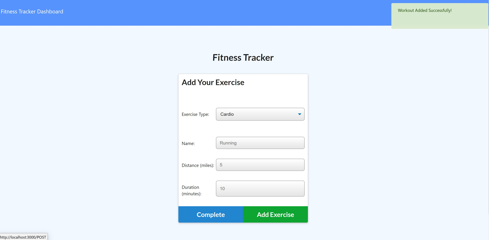
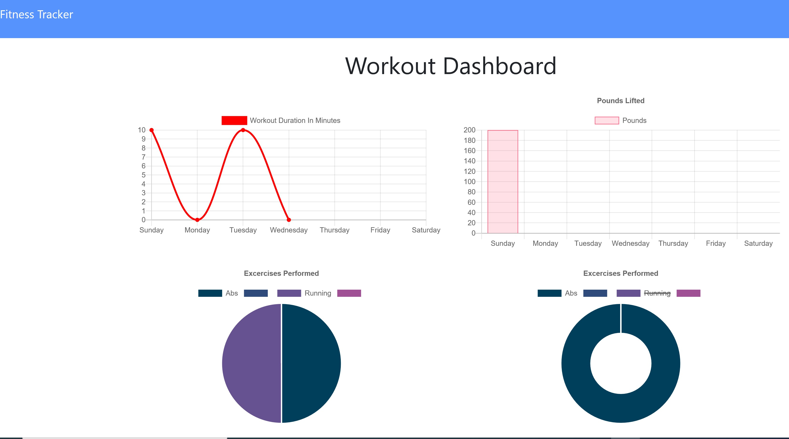

# Fitness-Tracker
# Merdad Karkudi

# Table of Contents
project repository link
Screenshots
Technologies
Project Description
Credits

# project repository link : 
https://github.com/mkarkuody/Fitness-Tracker

# Screenshots

# Technologies;
used Express and MongoDB database also Mongoose, 
used Express node module for Web server, and MongoDB to store data also used Mongoose to set up schema.

# Project Description
The Fitness Tracker lets user to addhis/her exercise on data base and see all work outs on a chart for entire week or last seven workouts.
The app interacts with a database containing "Workout" objects,  uses data base to track user's exercise and keeps each Workout contains an array of "Exercises." user can choose between two kind of workout and adjust durition time and sets of workouts. workout can be "cardio" or "resistance" with choosing one of them app displays different options for user. user enters all information and can finish the exercise and return to the main page or put more exercise.
By clicking on the "Fitness Tracker Dashboard" icon on the top of the page, users can tracktheir last seven (days) exercises and see then on the chart that app provide for them.

# Credits:
Got help Online from : 
•	https://www.google.com/
•	www.YouTube.com 
 Thanks to John Young my class instructor and Ben Vaagen my TA. special Thanks to Abdul Aziz my TA and Amanda Crawford My Tutor for helping me to understand the class and homework contents.